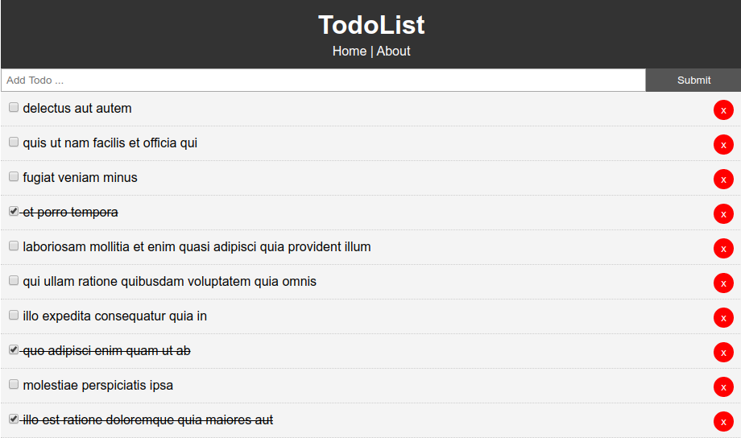

# React TODO APP
This is a todo app implemented using react.js

## Preview


## Installation

```bash
# Clone this repo
git clone https://github.com/kuruma99/React-TODO_App

# Open the directory
cd React-TODO_App

# Install dependencies
npm install

# Serve on localhost:3000
npm start

``` 

## Features
- [x] No frameworks used like bootstrap
- [x] Custom CSS
- [x] No database used
- [x] Enabled React Routing
